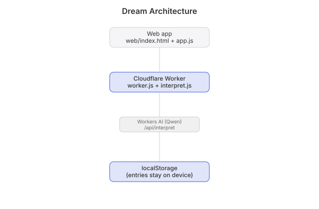

# Dream

  

Write down a dream, get back what it might mean.

Type it or say it. It's saved. An interpretation comes back: the symbols, the likely
feeling underneath, and what has shown up before in your own dreams.

That last part is the point. One interpretation is a party trick. A year of dreams with
the same three symbols in them is worth something.

## Status
v1 live: https://dream.heyitsmejosh.com

Write a dream. Save it. Hit Interpret. Entries never leave your browser. `WHITEPAPER.md`
makes the case. `roadmap.md` says what's next.

## Stack
One Cloudflare Worker. Static HTML, CSS and JS in `web/`, plus `/api/interpret` running Qwen on
Workers AI. No API keys. No build step. No dependencies. No database. Accounts and iOS come later.

## Not doing
No dream dictionary. No astrology. No numerology. No feed.

## Architecture

